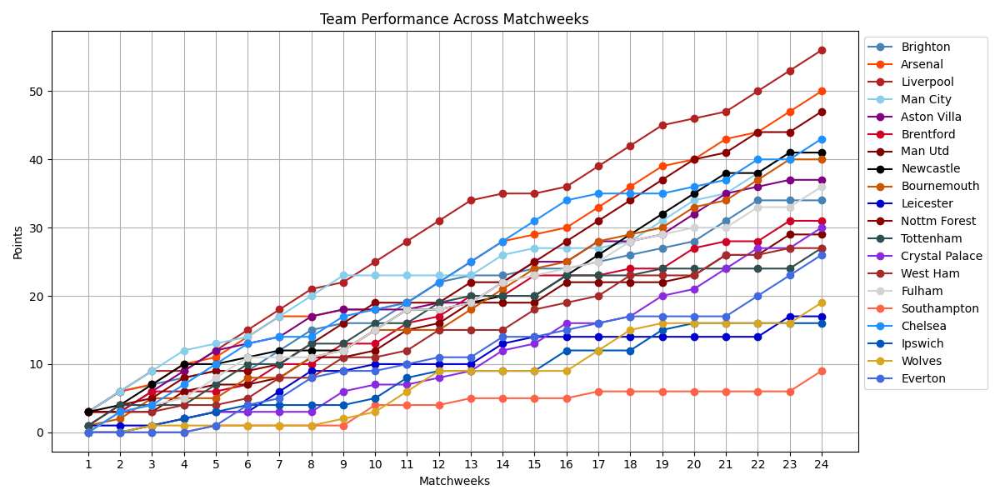
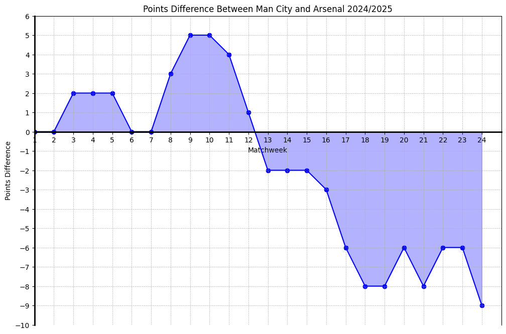

## About the project
 #### What is the scope of the project?

This project provides a visual representation of football team performances over multiple matchweeks. The goal is to track and analyse point progression using a dataset obtained via webscraping. This visualisation allows you to identify trends, compare teams, and gain insights into league performance over time. 

 #### Why did I decide to build  this?

The project was created because I couldn't readily find graphs that visualise how teams accumulate points throughout a season. Most resources focus on league tables or form guides, but I wanted a clear, graphical way to see how teams progress over time. I believe it was a great way to refamiliarise myself with Python and its various libraries.

 #### Which dataset was used?

The dataset used in this project was obtained through web scraping, where football team points were collected from [Transfermarkt](https://www.transfermarkt.co.uk/premier-league/formtabelle/wettbewerb/GB1?saison_id=2024&min=1&max=). The scraped data was then stored in a [CSV file](teams_data.csv) for further analysis. It was important that the data source had snapshots of points during each matchweek. I found this sort of data was hard to come by online but Transfermarkt ended up working.

<!--  -->
*This graph was plotted using Matplotlib on Python. The team colour data was stored in a JSON and used in the making of this graph*

*I also made a function that allows me to compare the points difference between two teams. This is useful when comparing title rivals and even relegation battles.*

 ####	Which tools were used?
The analysis was conducted using Python, Requests, Pandas, BeautifulSoup, Matplotlib, JSON

 ####	Future plans
 I would like to improve how I automate updates. At the moment I run the [main.py](main.py) weekly using cron. But as matchweeks don't always finish within the same calendar week this causes my script to run earlier than it should. Other ideas in improving this project are:

* Expand dataset by including other seasons and leagues
* Automate plot titles 
* Build functionality that allows you to only plot certain teams
* Potentially include other visulations for different analsyses
* Deploy as webapp - using Flask, Django or Steamlit
* Using plotly for interactive plots
* Convert the compare_points() function to take CSV files as input instead of dictionaries